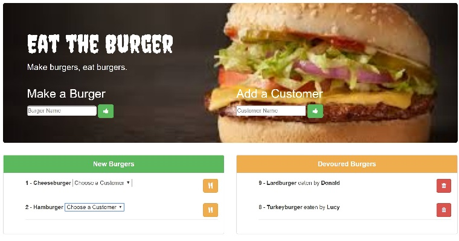

# Sequelize app "Burgers"

### A simple CRUD app that uses handlebars, Express, MySQL, and Sequelize to manipulate a "burger and eater" database.
## [Link to Live Heroku Page](https://boiling-garden-47959.herokuapp.com/)

What is Sequelize Burgers?

This is an app that lets users input the names of burgers they'd like to eat. Whenever a user submits a burger's name, the app will display the burger in `New Burgers`, the left side of the page. The user can additionally create customer names.
Each burger in the waiting area has a drop-down list of customers, that when chosen, will move the burger to `Devoured`, and display it with the customer who ate it on the right side of the page.
The app is performing CRUD functions from 2 tables, `burgers` and `eaters`.  The burger model is associated with the eater model by a foreign key - a burger can belong to a single eater, and an eater has many burgers.

## To Install
* Git Clone the repository
* Navigate to the folder where the repository exists using Git Bash or Terminal.
* Run the command `npm install` to download the required dependencies.
* Create a MySQL database using the schema provided.
* Then run the command `node .\server.js` to start a local host server.

### Languages & Programs Used
  * Sequelize
  * JavaScript
  * jQuery
  * Nodejs
  * Express

### Required Node packages and other sources
* [express-handlebars]
* [body-parser]
* [mysql]
* [sequelize]
* [method-override]

### Todo
- [ ] Reactivate empty-input error modal by moving new burger and new eater posts to events.js rather than handling from html.
- [ ] Allow eater deletion to check for cascade of burger deletion.
- [ ] Restyle page.
